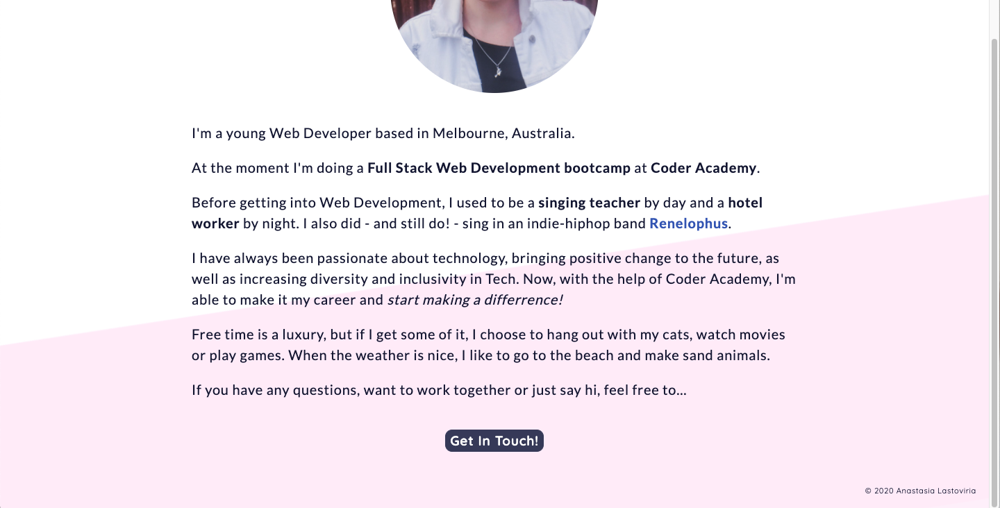

# My Portfolio Website

## **Purpose**

Hosting examples of my works.

## **Functionality / features**

### **Overview**
The site consists of 11 pages in total, including index, the set of 5 second level pages (about, contact etc.) and 5 pages containing blog posts

### **Components**
* The common _**navigation bar**_ is present on all the pages, and consists of 2 x parts: links to social media, as well as the main menu. The main menu collapses into a hamburger menu icon and a drop down menu on smaller screens. 
* Common components also include _**footer**_ with the copyright statement. 
* Most of the pages include a component of _**"quick link"**_ buttons, leading the viewer to the contact or project pages where appropriate.
* Graphic content is represented by the _**icons**_ (socials icons in the navbar, tech icons on the resume and project pages) and _**images**_ (on the About page, Projects, Blog, Blog posts).
* Projects and Blog pages have a common theme of _**"preview cards"**_, the separate box that includes images, text, header, links.
* Blog post pages share a component of a _**blog navbar**_, which includes left and right arrows and "back to blog" button.
* Finally, the contact page contains the _**form**_ with text fields, lables, text area for the message and submit button.

## Target audience
For this website, it's potential employers, collaborators and a general tech community.

## Tech stack
* _Planning:_ Trello
* _Code:_ HTML/SCC, SASS
* _Verstion control:_ GitHub 
* _Form functionality:_ Formspree
* _Deployment:_ Netlify
* _Code editor:_ VSCode

## Screenshots

### Trello Board

### Views

  
Mockups

Landing page 
 
About 
 
Projects 
 
Blog 
 
Blog Post 
 
Resume 
 
Contact 
 

  
Desktop

Landing page 
 
About 
 
Projects 
 
Blog 
 
Blog Post 
 
Resume 
 
Contact 
 

  
Mobile

Landing page 
 
About 
 
Projects 
 
Blog 
 
Blog Post 
 
Resume 
 
Contact 
 

  
Tablet

Landing page 
 
About 
 
Projects 
 
Blog 
 
Resume 
 
Contact 
 

