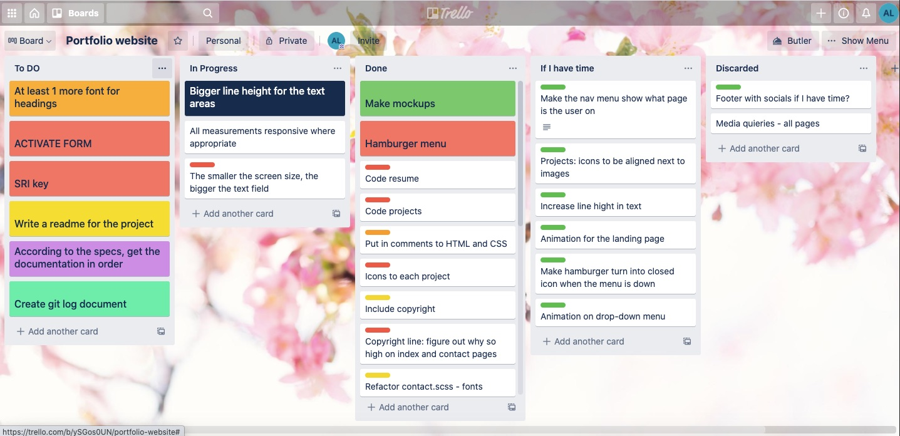
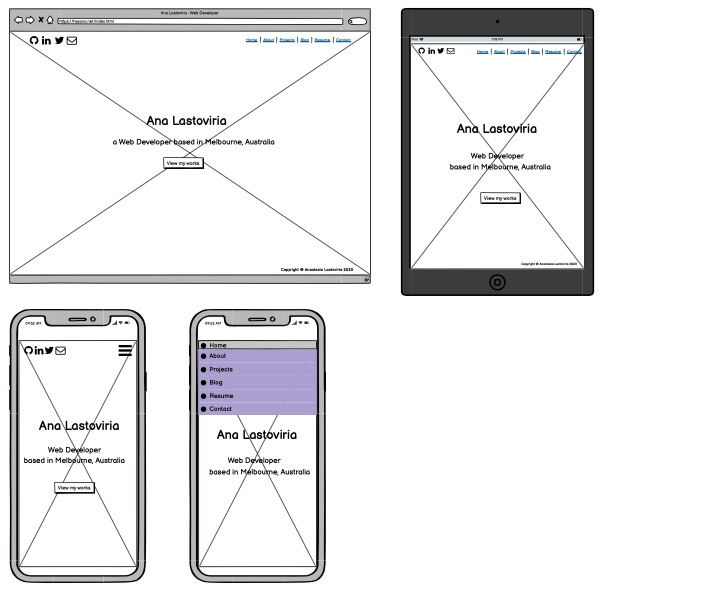
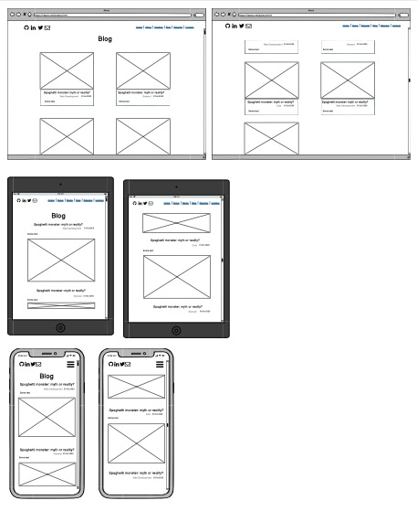
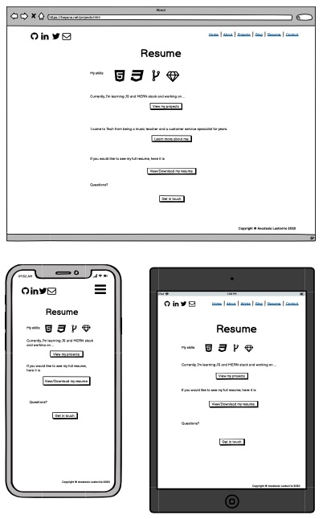

# My Portfolio Website

The website is viewable online [here](https://ana-lastoviria.netlify.app/).

The GitHub repository can be viewed [here](https://github.com/chivoi/portfolio).

## **Purpose**

This is the portfolio website made as an assigment submission at **Coder Academy**. 
It also has the purpose of representing myself online for the tech community, as well as serving as my online-resume.

## **Functionality / features**

### **Overview**
The site consists of 11 pages in total, including index, the set of 5 second level pages (about, contact etc.) and 5 pages containing blog posts

### **Components**
* The common _**navigation bar**_ is present on all the pages, and consists of 2 x parts: links to social media, as well as the main menu. The main menu collapses into a hamburger menu icon and a drop down menu on smaller screens. 
* Common components also include _**footer**_ with the copyright statement. 
* Most of the pages include a component of _**"quick link"**_ buttons, leading the viewer to the contact or project pages where appropriate.
* Graphic content is represented by the _**icons**_ (socials icons in the navbar, tech icons on the resume and project pages) and _**images**_ (on the About page, Projects, Blog, Blog posts).
* Projects and Blog pages have a common theme of _**"preview cards"**_, the separate box that includes images, text, header, links.
* Blog post pages share a component of a _**blog navbar**_, which includes left and right arrows and "back to blog" button.
* Finally, the contact page contains the _**form**_ with text fields, lables, text area for the message and submit button.

## Target audience
For this website, it's potential employers, collaborators and a general tech community.

## Tech stack
* _Planning:_ Trello
* _Code:_ HTML/SCC, SASS
* _Verstion control:_ GitHub 
* _Form functionality:_ Formspree
* _Deployment:_ Netlify
* _Code editor:_ VSCode

## Screenshots

### Trello Board half way in the works

### Mockups
Landing page 
 
About 
 
Projects 
 
Blog 
 
Blog Post 
 
Resume 
 
Contact 
 

### Desktop
Landing page 
 
About 
 
Projects 
 
Blog 
 
Blog Post 
 
Resume 
 
Contact 
 